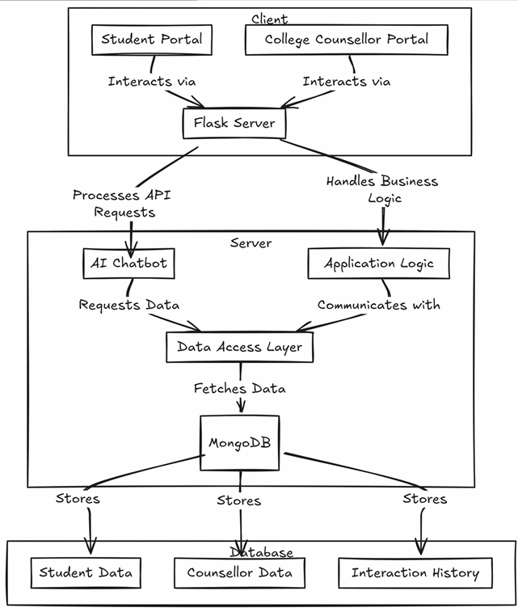
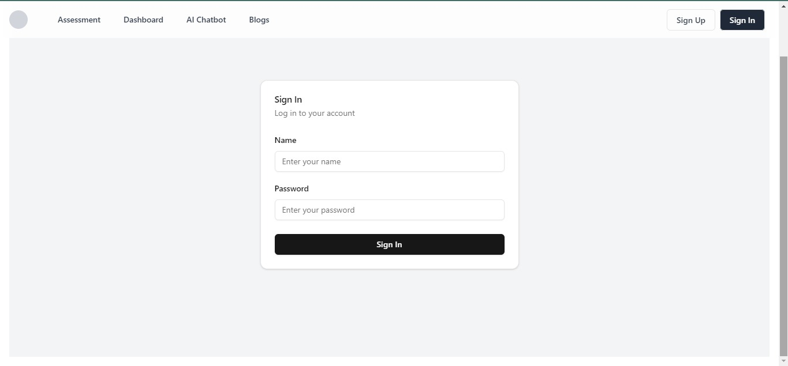
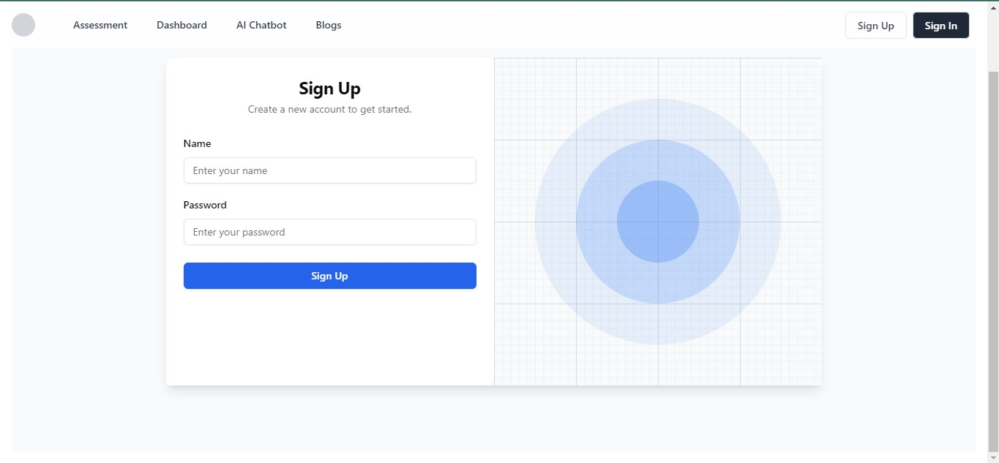
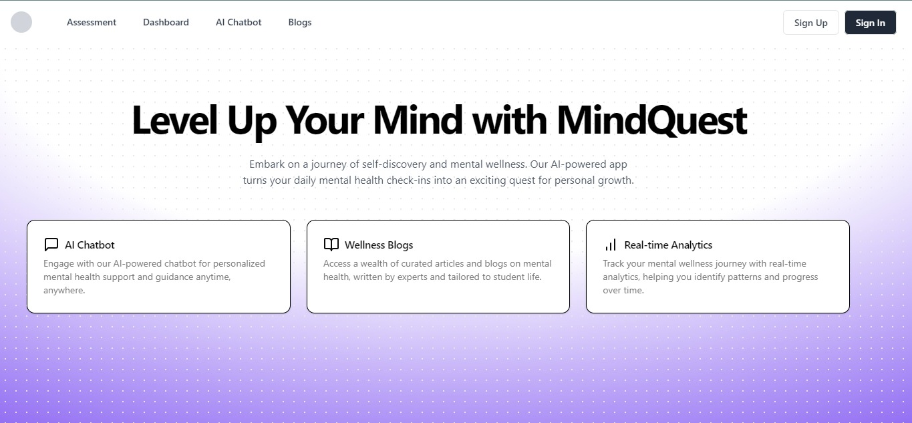
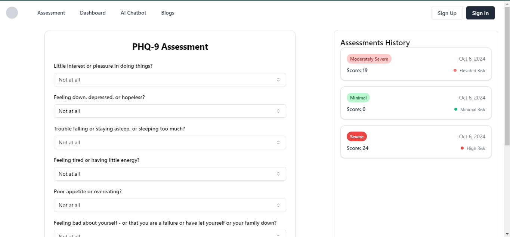
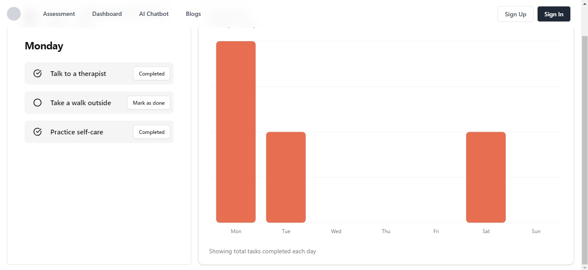
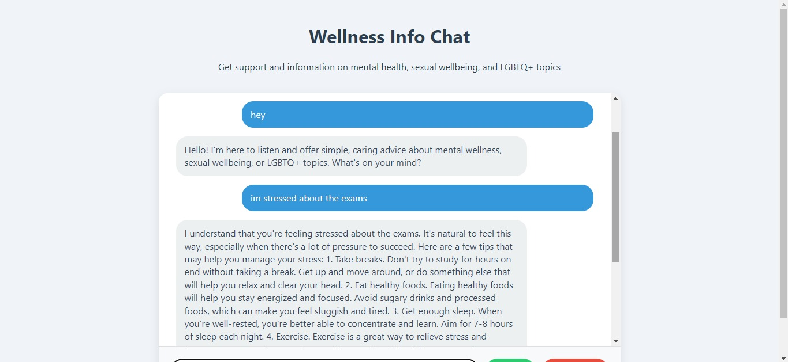
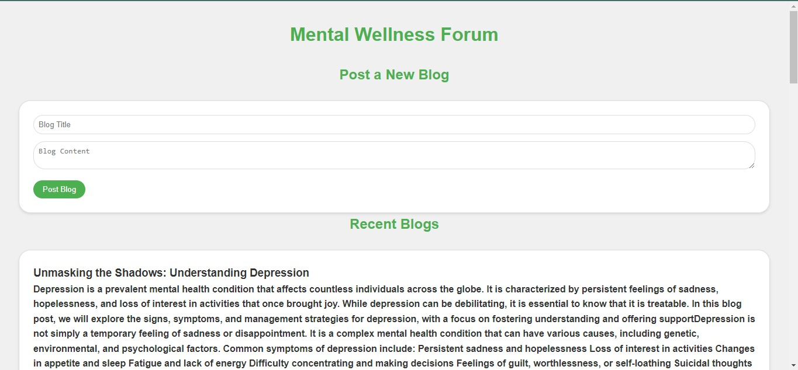

# AI-Driven Mental Well-Being Platform

## A Community-Centric and Gamified Support Solution for College Students

### Key Features:
- **Anonymous AI Chatbot Support**
- **Regular Mental Health Assessments**
- **Gamified Mental Health Tracking**
- **Community Forum and Peer Support Groups**
- **Inclusive Resource Hub**

### Expected Impact:
- Reduce anxiety and depression symptoms across diverse student groups.
- Improve academic performance and mental resilience in students.
- Increase student engagement in mental health support, focusing on inclusivity and acceptance.
- Foster a supportive community that encourages open dialogue on mental and sexual health.

### Future Scope:
- Advanced AI Personalization
- Teletherapy and Professional Support Integration
- Enhanced Gamification Elements
- Mood and Behavior Tracking
- Community-Building Features
- Resource Expansion
- Strategic Partnerships with Institutions and Corporations

### Tech Stack
- **Frontend**: React, TypeScript
- **Backend**: Flask, MongoDB
- **ML**: Keras, TensorFlow, Matplotlib, NumPy, Pandas
- **LLMs**: MentalLLaMA, Gemini AI

### Project Architecture


### Screenshots
#### Sign-In Page


#### Sign-Up Page


#### Main Page


#### Assessments


#### Dashboard


#### Chatbot


#### Blogs


### Getting Started
To run this project locally, follow these steps:
1. Clone the repository.
   ```bash
   git clone https://github.com/Yathin-KN/Techxcelerate-Bangalore-2024.git
